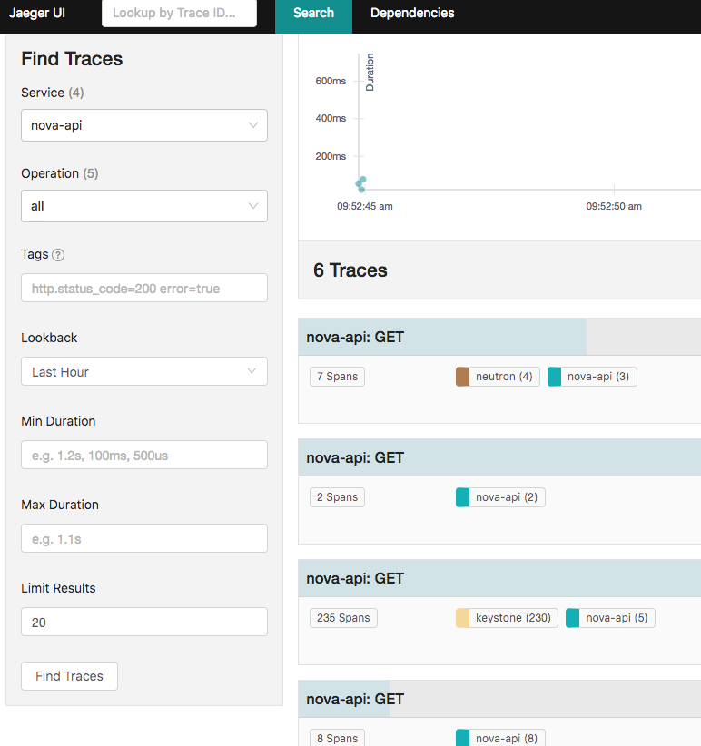

# openstack-opentracing
This library provides a simple (alpha quality) implementation of a wsgi middleware that can be inserted into
OpenStack APIs and can provide rudimentary tracing.

## Jaegertracing

More information is available here, here is a quick overview of the overall architecture:


## How to

### Install Jager tracing all in one
```bash 
docker run --name jaeger  -p 5775:5775/udp -p 5778:5778 -p 14268:14268 -p 6831:6831/udp -p 6832:6832/udp -p 16686:16686 jaegertracing/all-in-one:latest
```

__Important__:
The current jaeger_middleware is configured to use remote controlled sampling. It will only be turned on when the jaeger 
collector service is running (see above), this is to make sure that no sampling is done unless there is a listener.


### Install openstack-opentracing

Activate your virtualenv

```bash
source /opt/pf9/nova/bin/activate
cd /opt/pf9/nova/bin/
./python ./pip install git+https://github.com/platform9-incubator/openstack-opentracing.git
```

### Configure your service

Edit your paste.ini file and insert a new filter and add the filter to the pipeline
```bash
[filter:jaeger_v1]
paste.filter_factory = openstack_opentracing.jaeger_middleware:JaegerMiddleware.factory
config.logging = False
config.local_agent.reporting_host = 127.0.0.1
config.local_agent.reporting_port = 32769
config.local_agent.sampling_port = 32770
config.local_agent.sampling_host = 127.0.0.1
service_name = Server1
validate = True

[pipeline:public_api]
# The last item in this pipeline must be public_service or an equivalent
# application. It cannot be a filter.
pipeline = sizelimit url_normalize request_id build_auth_context jaeger_v1 token_auth admin_token_auth json_body ec2_extension user_crud_extension pf9_mfa_auth_extension_v2 public_service
```

### Restart your service

```bash
sudo service openstack-nova-api restart
```
Wait for a minute (default sampling refresh interval) and start making request.


## Check the UI

Connect to http://<ip-address>:16686/ to check the UI.
Make some nova-api requests and your tracing will show up automatically

I SSH into the DU and use the port forwarding
```bash
ssh -L 14268:127.0.0.1:14268 -L 16686:127.0.0.1:16686 pf9-test.platform9.net
```
### Screenshots



# Code
There is only one file which is interesting jaeger_middleware, which provides the middleware.
Check the test directory for a working example of a distributed tracing example which uses the middleware and uses oslo.* libraries. This will give you a good starting point.

# Ugly stuff

* Most of the code is to make sure 'eventlet ' services like OpenStack can work with jaeger_client library
primarly because jaeger_client assumes tornado. This is ugly and
would need to change as jaeger_client rids itself of tornado dependency
